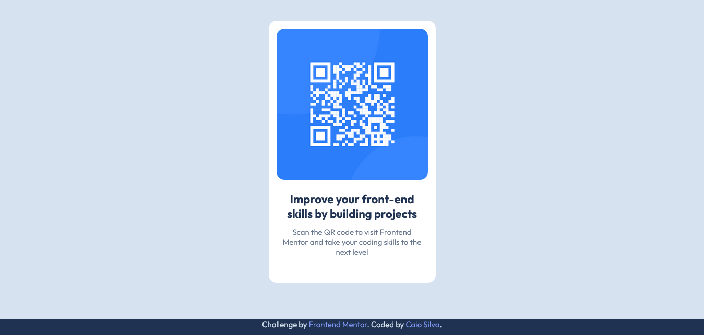

# Frontend Mentor - QR code component solution

Esta é minha solução para o desafio [QR code component challenge](https://www.frontendmentor.io/challenges/qr-code-component-iux_sIO_H) no Front-End Mentor.

## Conteúdo

- [Overview](#overview)
  - [Screenshot](#screenshot)
  - [Links](#links)
- [Sobre o projeto](#sobre-o-projeto)
  - [Feito com](#feito-com)
  - [O que aprendi](#o-que-aprendi)
  - [Desenvolvimento contínuo](#desenvolvimento-contínuo)
  - [Recursos Extras](#recursos-extras)
- [Autor](#autor)
- [Agradecimentos](#agradecimentos)

## Overview

### Screenshot

- **Desktop | width >= 1366px**

- **Tablets | width: 810px**

- **Smartphones | width: 375px**

### Links

- Projeto URL: [Repositório GitHub](https://https://github.com/CaioLopes5556/MySolution-QR-CODE-COMPONENT-MAIN)
- Live Site: [Deploy do Projeto](https://https://caiolopes5556.github.io/MySolution-QR-CODE-COMPONENT-MAIN/)

## Sobre o projeto

### Feito com

- Semantic HTML5 markup
- CSS custom properties
- Flexbox

### O que aprendi

Com este projeto tive oportunidade de exercitar e colocar em prática conhecimentos de posicionamento
de elementos utilizando o "display: flex" com CSS;

É um recurso que eu já havia utilizado antes em proejetos anteriores e considero muito prático e fácil de
manusear;

### Desenvolvimento Contínuo

Se necesário, pretendo desenvolver os próximos projetos utilizando "display: grid" para entender melhor como funciona,já que conheço pouco este recurso e não o utilizo tanto quanto o display flex.

Sei que é um ótimo recurso para manter a responsividade de uma pagina, então pretendo aprender mais sobre.

### Recursos Extras

- [MDN Web Docs](https://developer.mozilla.org/en-US/docs/Web/CSS) -
  Este site me ajudou a tirar algumas dúvidas sobre propriedades do Flexbox durante o desenvolvimento
  do projeto.

## Autor

- _Frontend Mentor_ - [@CaioLopes5556](https://www.frontendmentor.io/profile/CaioLopes5556)
- _Linkedin_ - [@caio-silva-42848a236](https://www.linkedin.com/in/caio-silva-42848a236)

## Agradecimentos

Para finalizar, gostaria de agradecer aos Gemêos do Dev em Dobro, por indicarem o Front-End Mentor em um de seus vídeos. Tem ajudado bastante a praticar conhecimentos de HTML, CSS e JS.
